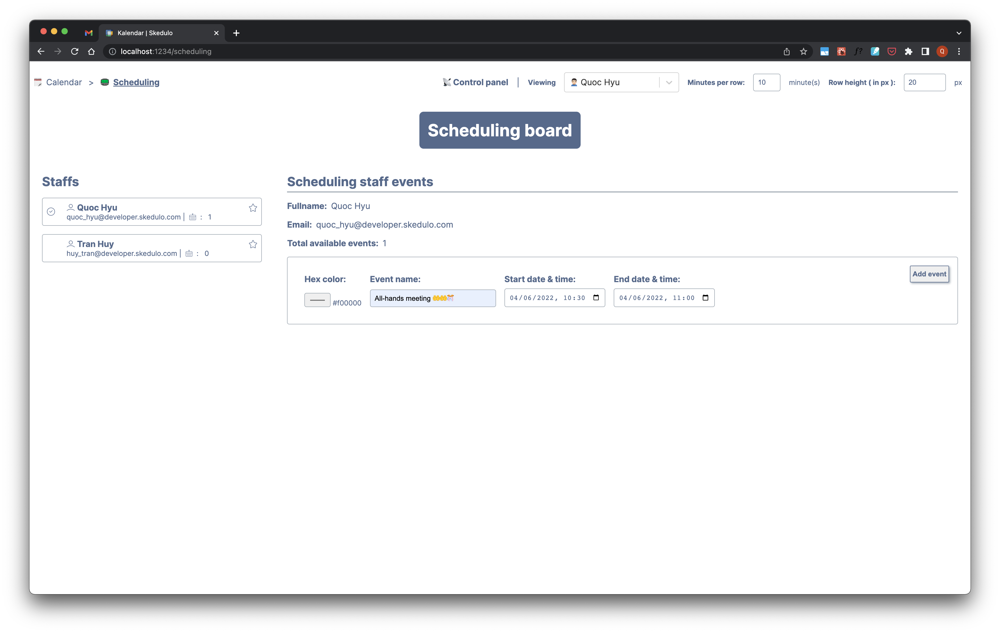
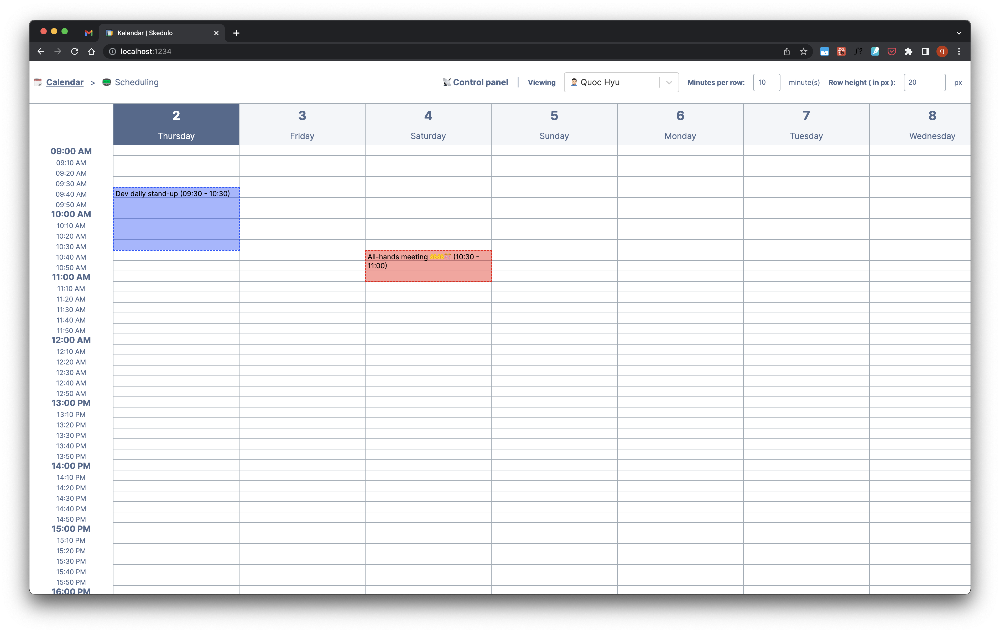
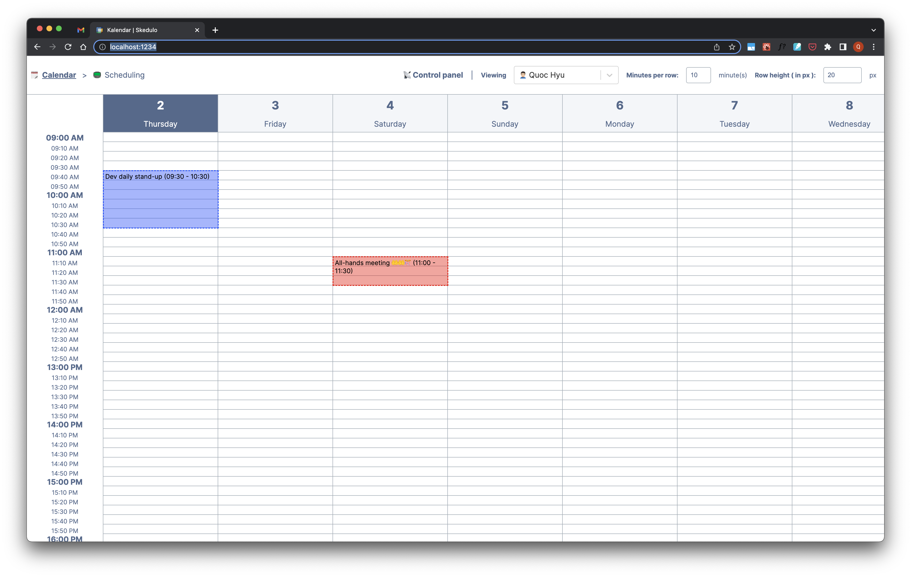

# Kalendar - Simplag functional test

## Features
1. Display events on calendar precisely (at minute level).
2. Create event block for each staff.
3. View calendar events for each staff.
4. Support changing event block times with drag & drop behaviour.

## Tech stack
1. React 18
2. ReactDnD (Drang & drop HTML5 backend)
3. Parcel (Javascript bundler)
4. json-server (mock server)

## Prerequisite
1. Nodejs
2. `npm` or `yarn`(package manager)

## Start project on local environment
- Run `yarn` or `npm install` to install project's dependencies.
- Run `yarn start` or `npm run start` to start a mock API server on port `:4000`, and FE on port `:1234`
- Website is available on `http://localhost:1234`
- All the data is available in `src/mock/db.json`

## Project screenshots

